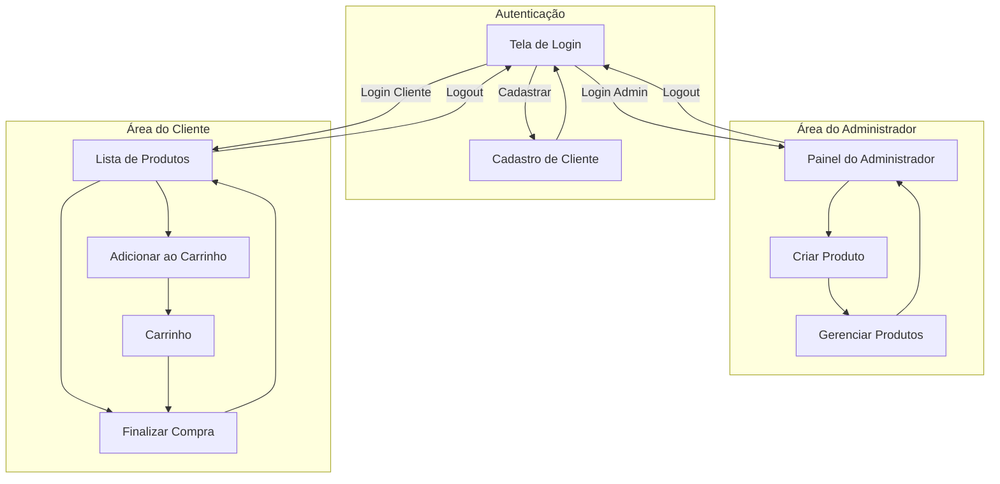

# Projeto 02 - Sistema de Loja Mobile

Projeto voltado para fixação dos conteúdos de **React Native**, **useEffect** e **AsyncStorage**.
Neste projeto você irá criar um **mini sistema de loja**, com usuários, produtos e carrinho de compras.

O objetivo é aprender a **armazenar dados localmente no dispositivo**, simulando o funcionamento básico de um aplicativo de e-commerce.

Caso você queira trabalhar um **tema livre de loja** (ex: loja de jogos, loja de roupas, loja de livros, loja de comida, etc), lembre-se de manter **todas as funcionalidades solicitadas**.

## Estrutura mínima

O projeto deve conter pelo menos as seguintes telas:

- Tela 1 – Login
- Tela 2 – Cadastro de clientes
- Tela 3 – Área do dono da loja (admin)
- Tela 4 – Lista de produtos
- Tela 5 – Carrinho de compras

## Observações

- O sistema deve possuir **uma conta fixa de administrador (dono da loja)**.
- O administrador será responsável por **cadastrar os produtos da loja**.
- Clientes devem ser capazes de **criar contas diretamente na tela de cadastro**.
- Os dados devem ser **armazenados utilizando AsyncStorage**.
- Cada cliente deve possuir **seu próprio carrinho de compras**.
- Após o login, o usuário deve ser direcionado para a área correspondente (admin ou cliente).
- Deve existir opção de **logout (sair da conta)**.
- As telas devem possuir **personalização visual criada pelo próprio aluno**.
- Quaisquer criações feitas com **código base de IA receberão decremento na nota**.

## Funcionalidades obrigatórias
### Sistema de login
- Login com usuário e senha
- Conta fixa de administrador
- Cadastro de novos clientes
### Administração da loja
O dono da loja deve ser capaz de:
- Adicionar novos produtos
- Informar:
  - nome do produto
  - descrição
  - preço
  - imagem (link ou imagem simples)
- Exibir lista de produtos cadastrados
### Área do cliente
Clientes devem ser capazes de:
- Visualizar os produtos da loja
- Adicionar produtos ao carrinho
- Escolher a quantidade desejada
- Visualizar os itens do carrinho
- Realizar compra
### Persistência de dados
- Usuários devem ser salvos no AsyncStorage
- Produtos devem ser salvos no AsyncStorage
- Carrinhos devem ser salvos no AsyncStorage
- Os dados **não devem desaparecer ao fechar o aplicativo**.

## Desafio (Funcionalidades extras)
### Sistema de estoque
O administrador poderá informar:
- quantidade disponível de cada produto

Ao realizar uma compra:
- a quantidade comprada deve diminuir do estoque original

### Compra direta
O cliente poderá:
- comprar diretamente na tela de produtos

Ou
- adicionar ao carrinho e finalizar a compra depois

## Critérios de avaliação

O projeto valerá 10 pontos no total.

### 1. Design da aplicação (2 pts)

| Avaliação da interface do aplicativo: | Qtd |
| --- | --- |
| [✔] organização visual | 0.5 |
| [✔] legibilidade | 0.5 |
| [✔] uso de cores | 0.5 |
| [✔] disposição dos elementos na tela | 0.5 |

### 2. Funcionalidade do sistema (2 pts)

| Avaliação do funcionamento geral | Qtd | 
| --- | --- |
| [✔] login funcionando | 0.2 |
| [✔] cadastro funcionando | 0.5 |
| [✔] criação de produtos | 0.4 |
| [✔] visualização de produtos | 0.2 |
| [✔] carrinho funcionando | 0.5 |
| [✔] compra funcionando | 0.2 |

### 3. Organização do código (2 pts)

| Avaliação da estrutura do projeto | Qtd | 
| --- | --- |
| [✔] separação em arquivos | 0.6 |
| [✔] nomes de variáveis objetivos | 0.6 |
| [✔] organização do código | 0.6 |
| [✔] uso correto de componentes | 0.2 |

### 4. Apresentação do projeto (2 pts)

| Durante a apresentação o aluno deve ser capaz de | Qtd |
| --- | --- |
| [✔] explicar como funciona o login | 0.2 |
| [✔] explicar como os produtos são salvos | 0.7 |
| [✔] explicar como o carrinho funciona | 0.7 |
| [✔] mostrar onde o AsyncStorage está sendo utilizado | 0.4 |

## Tempo de entrega e pontuação

### O projeto possui prazo escalonado de entrega.

| Data          | Pontuação máxima | Apresentação |
|---------------|------------------|--------------|
| 05/03 a 20/03 | até 2,0 pontos   | 23/03        |

A pontuação de prazo será **somada à nota da apresentação**.

## Instruções de entrega

- Dê estrela no repositório atual
- Acesse seu projeto no Snack Expo
- Clique no botão Download no canto superior direito
- Extraia todos os arquivos do projeto
- Crie um repositório no GitHub com o nome:
`projeto 02 sistema de loja mobile`
- Envie todos os arquivos para o repositório
- Adicione no campo Website do repositório o link do seu projeto no Snack Expo

## Diagrama do Fluxo de Telas

## Exemplos 
Utilize como exemplo o seu projeto 01 e o seguinte arquivo:
- [Exemplo 05 (useEffect, AsyncStorage e await)](https://snack.expo.dev/@samuel.ps/aula-exemplo-05)
